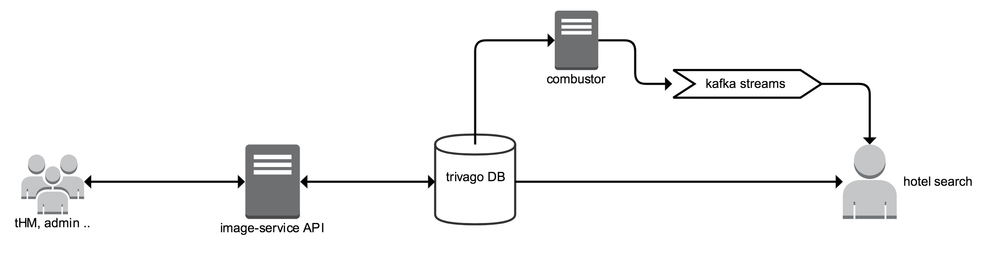
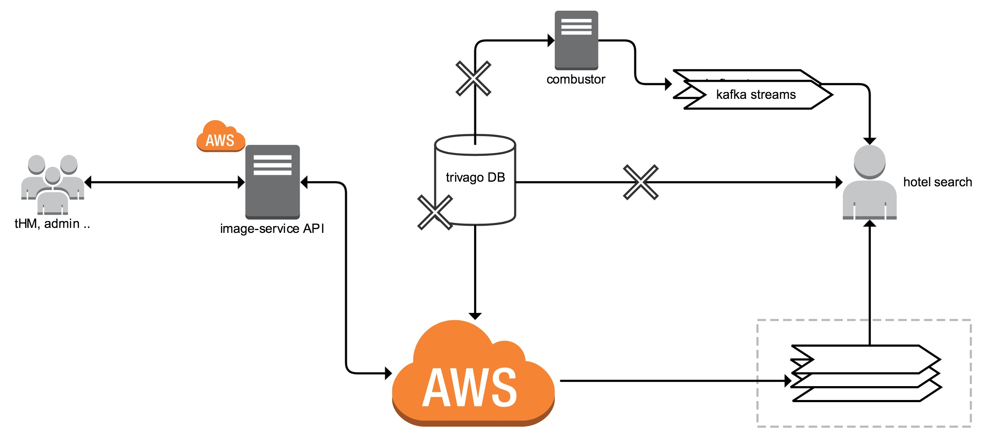
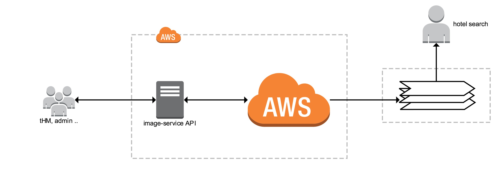
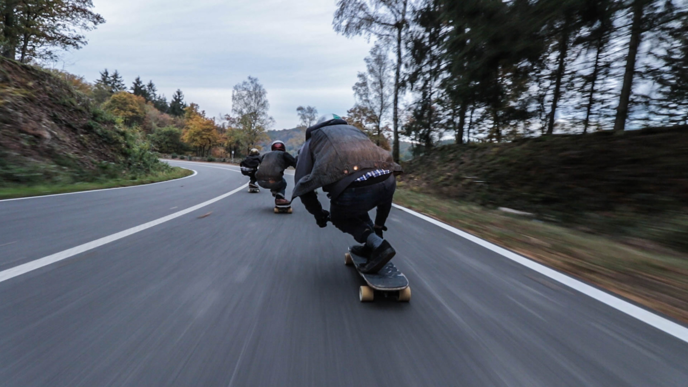
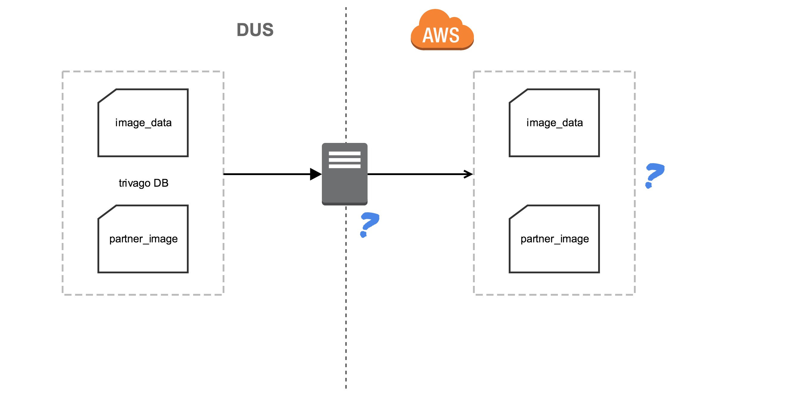
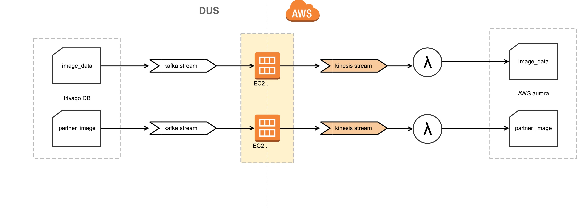
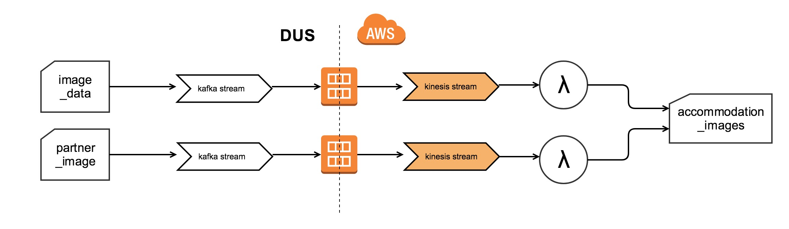
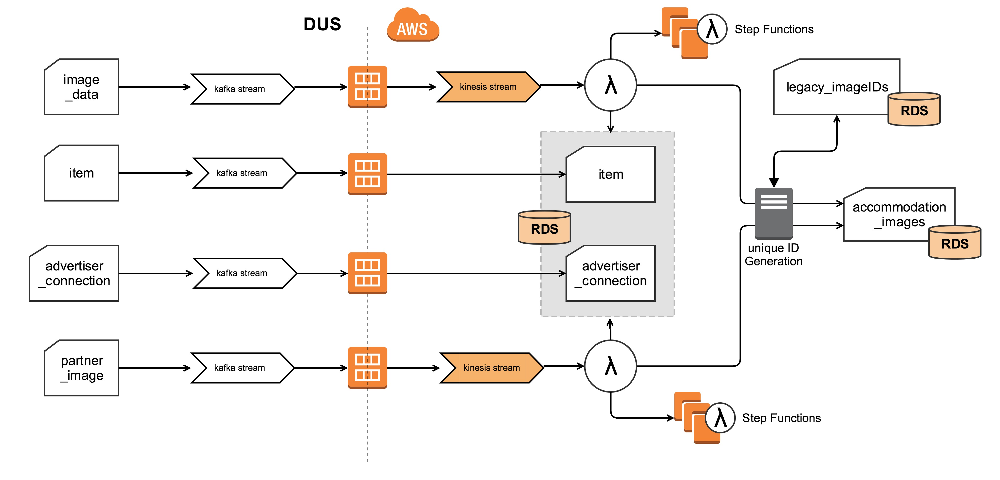
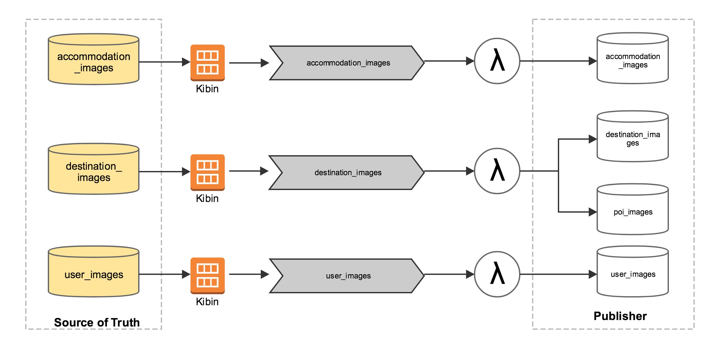
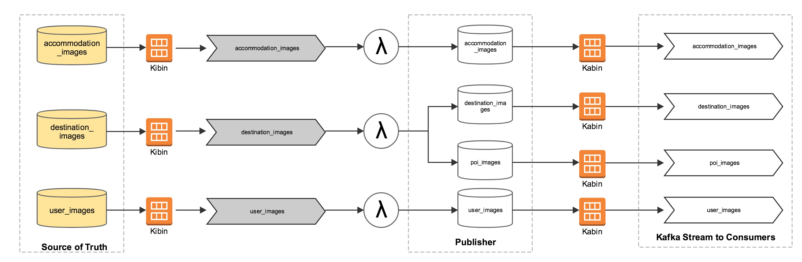

# Visual Content!

---

## What do we do?

* All the images in trivago
* To manage and serve
* image-service

---

## AWS migration

---

# What are we moving to AWS?

* image records in trivago db
* all the services hosted in DUS
* images are already in S3

---

# The landscape now!

---

# The plan

---

# Long run

---

# Milestones

* simple database replication
* creation of source of truth database
* create Kafka streams from AWS
* _migration of API reads and writes_
* _migration of other processes_

---

# Milestone #1 : simple database replication

---

# Moving the data over

---

# unknowns

* How do we get the data from DUS
* How do we make it reactive
* How do we store the data in AWS

---

# and ..

* _How do we get the data from DUS_ - kafka streams
* _How do we make it reactive_ - Kafka to Kinesis
* _How do we store the data in AWS_ - Aurora RDS

---

# and ....

---

# Milestone #2 : Source of Truth

---

# What were we trying to solve

* Better data structure
* Better classification
* New unique identifiers
* Single source for our data

---

# Transformation

.jpg)

---

# Getting Data to AWS

* Kafka streams from trivagodb
* Sink Kafka to Kinesis streams
* SPS toolkit (platform)

---

# Not really trivial!

---

# Dependencies

* item
* item2partner (advertiser connection)

---

# The plan

---

# The execution

---

# The execution

* Sink of item and item2partner
* New image id generation
* Delay in the sink of meta tables

---

# MILESTONE #3 : Data delivery

---

# Publisher DB

* Synchronised version of Source of Truth
* Active images
* Images that can be used directly
* Kafka streams from db

---

# What did we need?

* Stream data from Source of Truth
* Filter data reactively
* Create Kafka streams

---

# What did we use?

* _Stream data from Source of Truth_ Kibin (RDS to Kinesis)
* _Filter data reactively_ lambda on Kinesis
* _Create Kafka streams_ Kabin (RDS to Kafka)

---

# Kabin and Kibin

* Binary log readers
* _Kibin_ -> Descriptive
* _Kabin_ -> Identity

---

# Running Kibin

* Initial Bootstrap
* _Data Feeder on ECS_
* Kibin as an EC2 instance

---

# How it looks

---

# Running Kabin

* Stream per table
* Kabin as an EC2 instance

---

# Full picture

---

# Monitoring

---

# Cloudwatch Alarms

* Lambda errors
* Database load
* Kinesis Iterator Age
* EC2 errors

---

# Notification Channels

* e-mail
* Slack

---

# Dashboards

* Cloudwatch
* _Lambdas_
* _Aurora Instances_

---

# Monitoring Business Metrics

* Looker
* Queries on Source of Truth
* Runs on Amazon ECS

---

# Where are we now?

---

* Streams delivered from data in AWS
* _ACCOMMODATION MAIN IMAGES_
* All data stored in AWS
* New streams can be built from AWS

---

# Questions!

